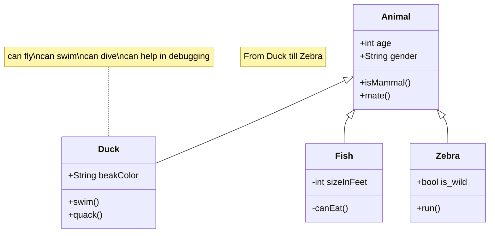

# Mermaid AI Chatbot - Next.js Application

This is a Next.js application featuring an AI-powered chatbot that generates and renders Mermaid diagrams inline within the chat interface. The chatbot can create various types of diagrams based on natural language descriptions.

## Features

- 📊 Generate flowcharts, sequence diagrams, class diagrams, and more
- 🎨 Inline Mermaid diagram rendering in chat interface
- 🤖 AI-powered diagram creation from natural language descriptions
- 📈 Support for 10+ diagram types (flowchart, sequence, class, state, gantt, pie, journey, gitgraph, mindmap, timeline)
- 💬 Natural language queries for diagram generation
- 🎨 Modern UI with Tailwind CSS
- 🌙 Dark mode support
- 🛡️ Robust error handling for invalid diagram syntax
- 📋 Copy diagram source functionality
- 🔄 Real-time diagram rendering

## Getting Started

### Prerequisites

- Node.js 18+
- npm or yarn
- A Groq API key (get one from [Groq Console](https://console.groq.com/))

### Installation

1. Install dependencies:
```bash
npm install
```

2. Set up environment variables:
Create a `.env.local` file in the root directory:
```
GROQ_API_KEY=your_groq_api_key_here
```

3. Start the development server:
```bash
npm run dev
```

4. Open [http://localhost:3000](http://localhost:3000) in your browser.

## Usage

1. Navigate to the home page at [http://localhost:3000](http://localhost:3000)
2. Click "Start Diagram Chat" to access the chatbot
3. Ask the AI to create various types of diagrams, such as:

**Diagram requests:**
   - "Create a flowchart for user login process"
   - "Generate a sequence diagram for API authentication"
   - "Make a Gantt chart for project timeline"
   - "Draw a class diagram for a user management system"
   - "Create a state diagram for order processing"
   - "Generate a pie chart showing data distribution"

## Architecture

### API Routes

- `/api/chat` - Handles chat requests using the AI SDK and Groq with Mermaid diagram generation

### Components

- `Chatbot.tsx` - Main chat interface component with Mermaid rendering
- `MermaidDiagram.tsx` - Component for rendering Mermaid diagrams
- Chat page at `/chat` - Full-page chat experience

### Mermaid Integration

The application uses the official Mermaid npm package for diagram rendering:

- **AI Tool Integration**: The chatbot includes a `generateMermaidDiagram` tool that creates Mermaid syntax based on user descriptions
- **Inline Rendering**: Mermaid code blocks in chat messages are automatically detected and rendered as interactive diagrams
- **Error Handling**: Invalid Mermaid syntax is gracefully handled with error messages and source code display
- **Supported Diagram Types**: Flowcharts, sequence diagrams, class diagrams, state diagrams, Gantt charts, pie charts, user journey maps, git graphs, mindmaps, and timelines

## Development

### Scripts

- `npm run dev` - Start development server with Turbopack
- `npm run build` - Build for production
- `npm run start` - Start production server
- `npm run lint` - Run ESLint

### Project Structure

```
├── src/
│   ├── app/
│   │   ├── api/chat/route.ts    # Chat API endpoint with Mermaid tool
│   │   ├── chat/page.tsx        # Chat page
│   │   ├── layout.tsx           # Root layout
│   │   ├── page.tsx             # Home page
│   │   └── globals.css          # Global styles
│   └── components/
│       ├── Chatbot.tsx          # Chat component with Mermaid parsing
│       └── MermaidDiagram.tsx   # Mermaid diagram renderer
├── .env.local                   # Environment variables
└── package.json
```

## Troubleshooting

### Common Issues

1. **Missing API Key**: Ensure `GROQ_API_KEY` is set in `.env.local`
2. **Diagram Rendering Issues**:
   - Check browser console for Mermaid rendering errors
   - Ensure diagram syntax is valid
   - Try refreshing the page if diagrams don't render
3. **Port Conflicts**: Change the port in `package.json` if 3000 is in use
4. **Build Issues**: Run `npm install` to ensure all dependencies are installed

### Error Messages

- "GROQ_API_KEY environment variable is required" - Add your Groq API key to `.env.local`
- "Diagram Rendering Error" - Check the diagram syntax for errors
- Mermaid parsing errors - Verify the Mermaid syntax is correct

## Deploy on Vercel

The easiest way to deploy your Next.js app is to use the [Vercel Platform](https://vercel.com/new?utm_medium=default-template&filter=next.js&utm_source=create-next-app&utm_campaign=create-next-app-readme) from the creators of Next.js.

Check out our [Next.js deployment documentation](https://nextjs.org/docs/app/building-your-application/deploying) for more details.


